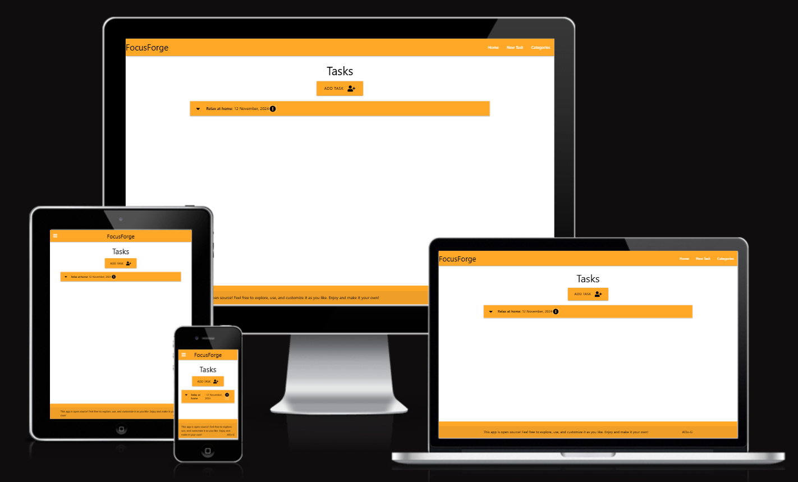
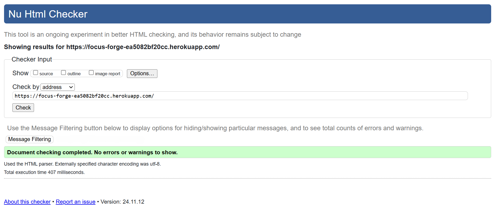
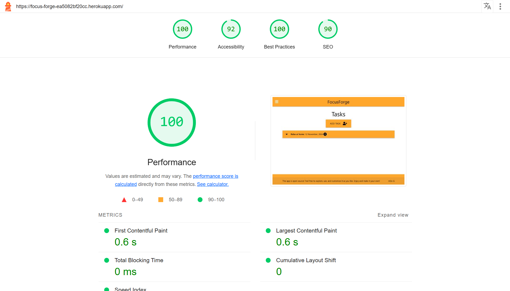
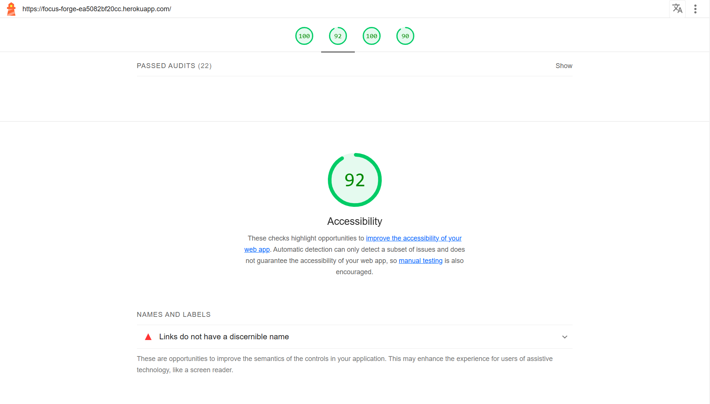
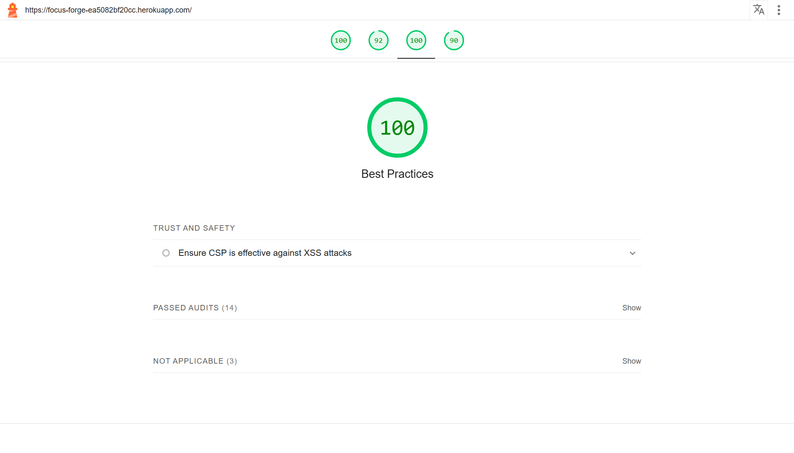
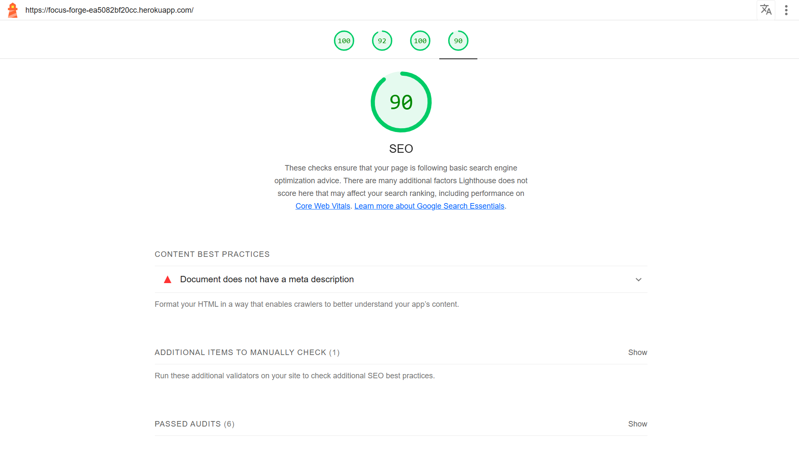

# FocusForge by Alex Gordon

## Content List
- [FocusForge App](#FocusForge-App)
- [User Story](#user-story)
- [Features and Wireframe](#features-and-wireframe)
- [Technology](#technology)
- [Testing](#testing)
- [Code Validation](#code-validation)
- [Deployment and Local Development](#deployment-and-local-development)
- [Credits](#credits)

## FocusForge App

### Project and Customer Goals

This app is designed to simplify task management by allowing users to add tasks and organise them into categories, providing a streamlined approach to productivity. The primary goal of the project is to offer an intuitive, user-friendly experience that enables users to stay organised and focused on completing their to-dos. By categorising tasks, users can prioritise and manage their workload effectively, reducing the chances of overlooking important items. The app caters to user needs by providing a clear and accessible interface that minimises distractions, and it fulfils user wants by offering flexible organisation options to suit a variety of task types and schedules. Ultimately, this software aims to empower users to take control of their tasks, helping them achieve their goals.

### Features and Functionality

The app offers essential features designed to efficiently manage tasks and categories through the use of CRUD operations—an acronym for Create, Read, Update, and Delete, which are the core functions for managing data in a database. **Create** allows users to add new tasks and categories, ensuring they can keep track of all their to-dos. **Read** enables users to retrieve and view their existing tasks and categories, ensuring easy access to their information at any time. The **Update** function allows users to edit task details or category names, making it easy to keep everything current and relevant. Finally, the **Delete** feature lets users remove tasks or categories that are no longer needed, helping to keep their lists organised and clutter-free. These features work seamlessly together to offer a comprehensive and intuitive way for users to manage their tasks and categories with ease.

### Information Architecture

The app is built on a **relational database structure**, where information is organised into tables that are interlinked to efficiently manage tasks and categories. At the core of the system, there are two main entities: tasks and categories. Each task is associated with a specific category, creating a relationship between the two. The tasks table stores information such as task names, descriptions, due dates, urgency and a reference to the category it belongs to. The categories table holds data about the different task categories, such as category names. These tables are linked through a foreign key, allowing tasks to be easily grouped under relevant categories. This relational structure ensures data integrity, simplifies updates, and allows users to view or modify tasks and categories without redundancy. By organising the data in this way, the app offers efficient data retrieval, updating, and management, helping users keep their information well-structured and accessible.

### Interface and Navigation Design

The interface and navigation design of the app have been carefully crafted to ensure a seamless experience across both mobile and desktop devices. By incorporating a responsive design using the Materialize front-end framework, the app adjusts to different screen sizes, providing a consistent and user-friendly experience on any device. The main navigation menu is easy to access and intuitive, offering quick access to key sections of the app while maintaining a clean and uncluttered layout. 

### Visual Design and Aesthetics

The colour scheme has been thoughtfully selected to enhance focus and engagement. The use of orange, in particular, evokes feelings of optimism, confidence, and enthusiasm, while also conveying warmth and agreeableness. Depending on its shade, orange can feel fresh, youthful, and creative, which aligns with the app's aim to encourage productivity in an inviting and energising environment. Additionally, the decision to keep the automatic default font was made to maintain a sense of formality, ensuring the design remains professional and easily readable without distraction. This careful combination of design elements ensures that users can navigate the app effortlessly while enjoying a visually appealing and emotionally uplifting experience.

## User Story

The user story for the app revolves around providing a simple and efficient task management solution for users at any stage of engagement, whether they are new, returning, or frequent users. New users will likely expect an easy onboarding process, where they can quickly add tasks, categorise them, and begin managing their to-dos without any learning curve. The app’s clean, intuitive interface and responsive design make it accessible even for first-time users, ensuring they can start using it right away. Returning users can expect a seamless experience with all their previously entered tasks and categories readily available, allowing them to pick up right where they left off. They may appreciate the app's ability to quickly edit, delete, or update tasks and categories as their needs evolve. Frequent users, on the other hand, will value the efficiency of the app in helping them stay organised and productive, relying on its features to stay on top of their tasks without distraction. Whether managing personal or professional projects, frequent users can expect a highly functional tool that streamlines their daily workflow.

## Features and Wireframe

### Home Page 

On the homepage wireframe, I want the menu to be clearly accessible, and the app's name to be prominent and easily noticeable. The main view should display the tasks that have already been created, so that users are immediately presented with what needs to be done upon opening the app—without unnecessary distractions. The footer should remain consistent throughout the app, including an open-source statement and a link to the original creator's GitHub.

### Categories Page

On the categories page, the header and footer should remain the same. The primary difference should be tiles displaying the created categories, each with options to edit or delete. There should also be a prominently placed, centrally located button to add new categories.

### Task Page

On the tasks page, the header and footer should remain the same to ensure consistency throughout the app. There should be an easy-to-use input area to add a task name, description, due date, and the category to which the task should be assigned. Include a centrally located, clearly visible "Add Task" button.

### Responsive Design

## Technology
+ This website was made in its entirety using Visual Code Studio
+ Wireframe were made in https://mockflow.com/
+ Additional software used to create this website include Chrome for previewing, inspecting and bug testing
+ Code languages used in this project are as follows:
    + HTML for the structure of the webpage 
    + CSS for the styling 
    + Javascript for the interactivity
    + Python+Flask for function 
    + PostgreSQL for Database
+ Materialize was used as a modern responsive front-end framework

## Testing

### Bugs and Fixes 

During the development process, I used Chrome Developer Tools to review my app, which helped me identify a number of bugs, particularly typos in the code. While reviewing the app’s deployment, I encountered a significant issue with getting the app successfully deployed to Heroku. I carefully went over all of my code files, checking for any mistakes. When I encountered an error, I turned to Stack Overflow to paste the error message in search of an explanation. Despite my efforts, the problem persisted, so I sought assistance from the student support team at Code Institute. Together, we discovered that the issue stemmed from an extra space in the URL of my database location. Although it seemed like a simple fix, it took several heads reviewing the code to spot the issue. This experience highlighted the importance of thorough debugging and collaboration in resolving even the smallest of errors.

## Code validation
I used <a href="https://validator.w3.org/" target="_blank">W3C</a> to validate my code. As I was using a framework for the front end styling, I have not included a one for CSS stylesheets 

### Lighthouse Report:

 
## Deployment and Local Development

### Deployment

The site is deployed using Heroku.

To deploy my app from GitHub to Heroku, I first ensured that my project was connected to a GitHub repository. After making the necessary changes to the code and committing them locally, I pushed the updates to the GitHub repository using the git push command. Next, I logged into my Heroku account through the Heroku CLI and linked the app to the appropriate GitHub repository by navigating to the Heroku dashboard, selecting the app, and linking it under the "Deploy" tab. I then set up automatic deployment, ensuring that every time changes were pushed to the GitHub repository, they would automatically trigger a new deployment on Heroku. For manual deployment, I used the Heroku CLI, running the command git push heroku main, which pushed the latest changes from the main branch of GitHub to Heroku. Once the push was complete, Heroku automatically built and deployed the app, and I could check the deployment status through the Heroku dashboard. This process ensured that my app was always up to date and successfully deployed.

### Local Development

#### How to Fork

To fork the repository:

1. Log in (or sign up) to Github.
2. Go to the repository for this project, [Al3x-G/Task_Manager_App](https://github.com/Al3x-G/Task_Manager_App).
3. Click the Fork button in the top right corner.

#### How to Clone

To clone the repository:

1. Log in (or sign up) to GitHub.
2. Go to the repository for this project, [Al3x-G/Task_Manager_App](https://github.com/Al3x-G/Task_Manager_App).
3. Click on the code button, select whether you would like to clone with HTTPS, SSH or GitHub CLI and copy the link shown.
4. Open the terminal in your code editor and change the current working directory to the location you want to use for the cloned directory.
5. Type 'git clone' into the terminal and then paste the link you copied in step 3. Press enter.

The Visual Studio Code preview extension was used to preview the website. To open this repository on Visual Studio Code:

+ Open an integrated terminal from the menu Terminal -> New Terminal
+ Clone the repo with the following command: git clone https://github.com/Al3x-G/Task_Manager_App
+ Change your terminal into that new subdirectory: cd Task_Manager_App
+ Open in Visual Studio Code: code .

## Credits
### Text Content
Text is written by the author https://github.com/Al3x-G

### Images
All images used were created by the author https://github.com/Al3x-G

### Code

All code was written by Alex Gordon working alongside Code Institute for support and guidance.

### Special mention

Code Institute for their continued support during this process of learning 